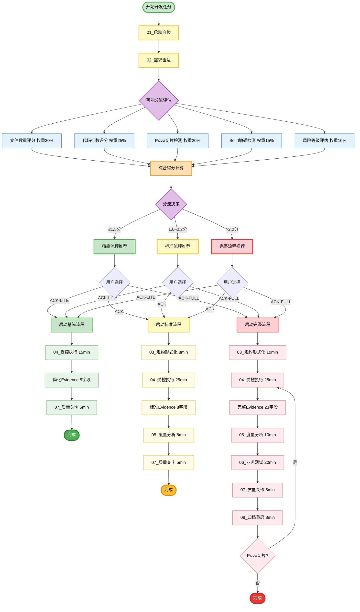
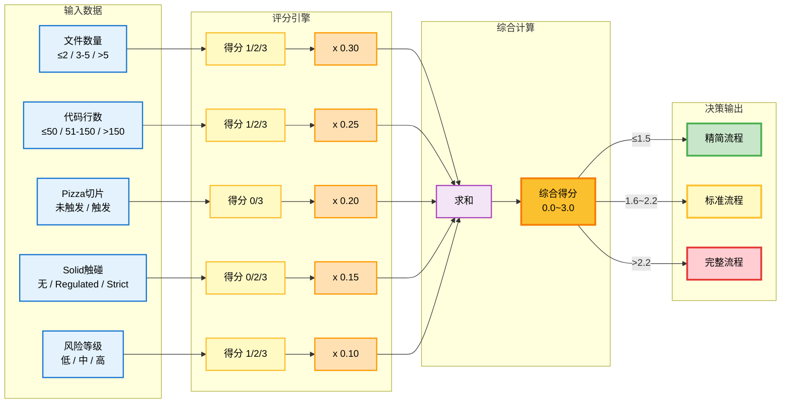
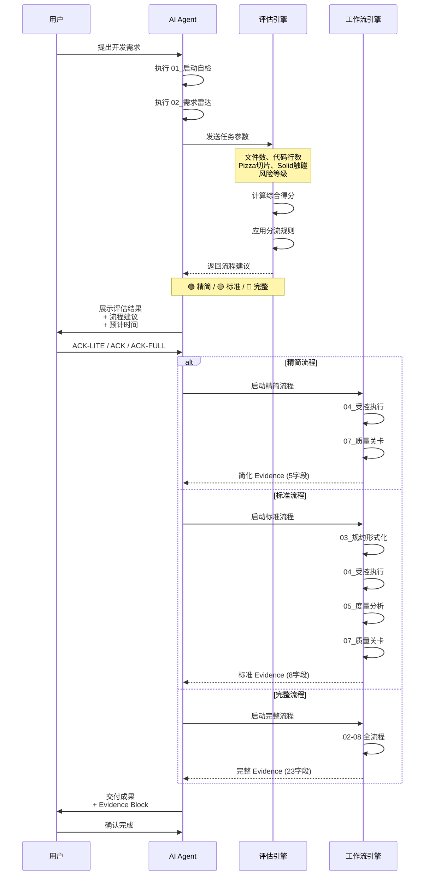
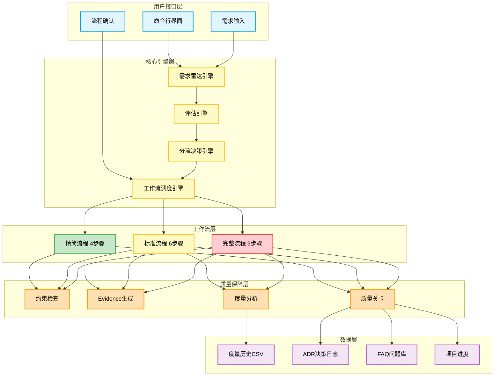

# 智能分流机制架构图

## 完整流程图

> 💡 提示：本图表需要 Mermaid 9.0+ 版本。如 IDE 预览失败，可访问 [mermaid.live](https://mermaid.live) 在线查看。

## 评分系统详细架构

## Evidence Block 分级架构

```mermaid
graph TB
    subgraph FlowType[" 流程类型 "]
        FT1[ACK-LITE<br/>精简流程]
        FT2[ACK<br/>标准流程]
        FT3[ACK-FULL<br/>完整流程]
    end
    
    subgraph EvidenceLevel[" Evidence Block 深度 "]
        FT1 --> E1[简化版 5字段]
        FT2 --> E2[标准版 8字段]
        FT3 --> E3[完整版 23字段]
    end
    
    subgraph E1Content[" 简化版字段 "]
        E1 --> E1F1[Compliance_Status]
        E1 --> E1F2[Target_Files]
        E1 --> E1F3[Test_Result]
        E1 --> E1F4[P0_Violations]
        E1 --> E1F5[Commit_Hash]
    end
    
    subgraph E2Content[" 标准版字段 "]
        E2 --> E2F1[+ Diff_Summary]
        E2 --> E2F2[+ Test_Run 含覆盖率]
        E2 --> E2F3[+ Constraint_Check P0/P1]
    end
    
    subgraph E3Content[" 完整版字段 "]
        E3 --> E3F1[+ Context_Log]
        E3 --> E3F2[+ Scan_Result]
        E3 --> E3F3[+ Reverse_Proof]
        E3 --> E3F4[+ Solid_Touch]
        E3 --> E3F5[+ Approval_Hash]
        E3 --> E3F6[+ Asset_Update]
        E3 --> E3F7[+ ADR_Entry]
        E3 --> E3F8[+ 完整约束检查]
    end
    
    style FT1 fill:#c8e6c9,stroke:#4caf50,stroke-width:2px,color:#000
    style FT2 fill:#fff9c4,stroke:#fbc02d,stroke-width:2px,color:#000
    style FT3 fill:#ffcdd2,stroke:#e53935,stroke-width:2px,color:#000
    
    style E1 fill:#c8e6c9,stroke:#4caf50,stroke-width:3px,color:#000
    style E2 fill:#fff9c4,stroke:#fbc02d,stroke-width:3px,color:#000
    style E3 fill:#ffcdd2,stroke:#e53935,stroke-width:3px,color:#000
    
    style E1F1 fill:#e8f5e9,stroke:#66bb6a,stroke-width:1px,color:#000
    style E1F2 fill:#e8f5e9,stroke:#66bb6a,stroke-width:1px,color:#000
    style E1F3 fill:#e8f5e9,stroke:#66bb6a,stroke-width:1px,color:#000
    style E1F4 fill:#e8f5e9,stroke:#66bb6a,stroke-width:1px,color:#000
    style E1F5 fill:#e8f5e9,stroke:#66bb6a,stroke-width:1px,color:#000
    
    style E2F1 fill:#fffde7,stroke:#fbc02d,stroke-width:1px,color:#000
    style E2F2 fill:#fffde7,stroke:#fbc02d,stroke-width:1px,color:#000
    style E2F3 fill:#fffde7,stroke:#fbc02d,stroke-width:1px,color:#000
    
    style E3F1 fill:#ffebee,stroke:#e57373,stroke-width:1px,color:#000
    style E3F2 fill:#ffebee,stroke:#e57373,stroke-width:1px,color:#000
    style E3F3 fill:#ffebee,stroke:#e57373,stroke-width:1px,color:#000
    style E3F4 fill:#ffebee,stroke:#e57373,stroke-width:1px,color:#000
    style E3F5 fill:#ffebee,stroke:#e57373,stroke-width:1px,color:#000
    style E3F6 fill:#ffebee,stroke:#e57373,stroke-width:1px,color:#000
    style E3F7 fill:#ffebee,stroke:#e57373,stroke-width:1px,color:#000
    style E3F8 fill:#ffebee,stroke:#e57373,stroke-width:1px,color:#000
```

## 典型场景分流示例

```mermaid
graph TB
    subgraph Scenario1[" 场景1 修改字段校验 "]
        SC1[修改用户名长度<br/>20→50]
        SC1 --> SC1_Files[文件 1个<br/>UserDTO.java]
        SC1 --> SC1_Lines[代码 1行]
        SC1 --> SC1_Score[得分 0.65]
        SC1_Score --> SC1_Flow[精简流程]
        SC1_Flow --> SC1_Time[30min]
    end
    
    subgraph Scenario2[" 场景2 新增CRUD "]
        SC2[部门管理CRUD]
        SC2 --> SC2_Files[文件 4个<br/>Controller/Service/Mapper/XML]
        SC2 --> SC2_Lines[代码 120行]
        SC2 --> SC2_Score[得分 1.8]
        SC2_Score --> SC2_Flow[标准流程]
        SC2_Flow --> SC2_Time[60min]
    end
    
    subgraph Scenario3[" 场景3 数据库迁移 "]
        SC3[新增用户积分表<br/>+积分模块]
        SC3 --> SC3_Files[文件 8个<br/>+db/migration/]
        SC3 --> SC3_Lines[代码 300行]
        SC3 --> SC3_Solid[Solid-Strict]
        SC3 --> SC3_Score[得分 2.7]
        SC3_Score --> SC3_Flow[完整流程]
        SC3_Flow --> SC3_Time[93min]
    end
    
    style SC1 fill:#e8f5e9,stroke:#4caf50,stroke-width:2px,color:#000
    style SC1_Files fill:#e8f5e9,stroke:#66bb6a,stroke-width:1px,color:#000
    style SC1_Lines fill:#e8f5e9,stroke:#66bb6a,stroke-width:1px,color:#000
    style SC1_Score fill:#e8f5e9,stroke:#66bb6a,stroke-width:1px,color:#000
    style SC1_Flow fill:#c8e6c9,stroke:#4caf50,stroke-width:3px,color:#000
    style SC1_Time fill:#e8f5e9,stroke:#66bb6a,stroke-width:1px,color:#000
    
    style SC2 fill:#fffde7,stroke:#fbc02d,stroke-width:2px,color:#000
    style SC2_Files fill:#fffde7,stroke:#fbc02d,stroke-width:1px,color:#000
    style SC2_Lines fill:#fffde7,stroke:#fbc02d,stroke-width:1px,color:#000
    style SC2_Score fill:#fffde7,stroke:#fbc02d,stroke-width:1px,color:#000
    style SC2_Flow fill:#fff9c4,stroke:#fbc02d,stroke-width:3px,color:#000
    style SC2_Time fill:#fffde7,stroke:#fbc02d,stroke-width:1px,color:#000
    
    style SC3 fill:#ffebee,stroke:#e53935,stroke-width:2px,color:#000
    style SC3_Files fill:#ffebee,stroke:#e57373,stroke-width:1px,color:#000
    style SC3_Lines fill:#ffebee,stroke:#e57373,stroke-width:1px,color:#000
    style SC3_Solid fill:#ffebee,stroke:#e57373,stroke-width:1px,color:#000
    style SC3_Score fill:#ffebee,stroke:#e57373,stroke-width:1px,color:#000
    style SC3_Flow fill:#ffcdd2,stroke:#e53935,stroke-width:3px,color:#000
    style SC3_Time fill:#ffebee,stroke:#e57373,stroke-width:1px,color:#000
```

## 用户交互时序图

## 系统组件架构

---

## 图表说明

### 1. 完整流程图
展示从任务开始到完成的完整流程，包含智能分流决策点和三种流程的详细步骤。

### 2. 评分系统详细架构
展示评分引擎如何根据 5 个维度计算综合得分，并应用阈值进行分流决策。

### 3. Evidence Block 分级架构
展示三种流程对应的 Evidence Block 深度差异。

### 4. 典型场景分流示例
展示 3 个典型场景的评分和分流结果。

### 5. 用户交互时序图
展示用户、AI、评估引擎、工作流引擎之间的交互时序。

### 6. 系统组件架构
展示智能分流机制的系统架构，包含用户接口层、核心引擎层、工作流层、质量保障层、数据层。

---

**维护人**: {MAINTAINER}
**创建日期**: 2026-06-23
**版本**: v1.1.0
